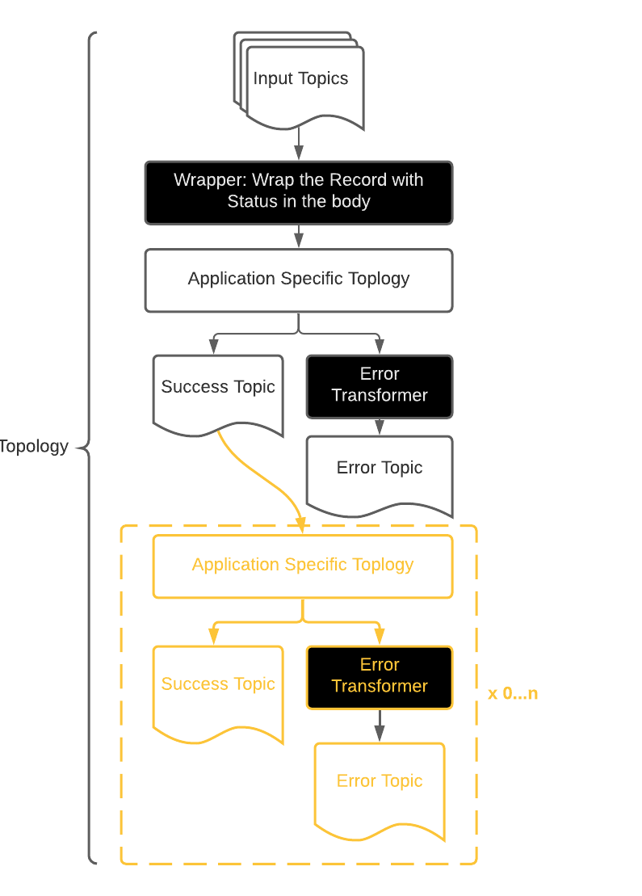

# Kafka Streams Error Handling: A Recommended Approach

## Background

- Provide a pattern to produce to an Error topic, given failure modes.

### What are the processing failure modes?

#### Data Mapping/Transformation Exception (Validation)

Scenarios where the incoming event fails to meet a _functional_ rule. By functional rule, I mean constraints that may not be readily solvable 
through data type enforcement (schemas). For example: # of digits in a phone number exceeds 10. 

This would be primarily part of a stateless operation: `flatMap, map`, though it is also possible to use staful transformations using the `transform, transformValues`.

##### Join Exceptions (Crossing Streams)

Scenarios where a tuple consisting of either a KTable or a KStream are joined and there exists a miss. 

### Constraints

- The error message must include offset/partition/topic information for the faulty record in its metadata
    - This will aid triage and potentially replaying the messages
- The above information are only available in part of processing where `context` is available. Which is only available during Stateful Transformations

## The Actual Approach

### Assumption

- All Applications consume from a set of topics and produce to a set of topics. (Topic -> Topic flows)

### Approach

- Use the Router pattern to route between `ERROR` events and `SUCCESS` messages. 
- Utilize `branch`  to implement the Router Pattern. 
- `branch` at each part of the Topology that produces data to a downstream topic
    - During the end lifecycle of the Topology
- Utilize a `RecordWrapper` to wrap the incoming object that is deserialized and adds a `status` to the Record. 
E.g. [RecordWrapper](./src/main/java/com/mehryar/example/kafkastreamserrorhandling/model/RecordWrapper.java)
- Per Error Mode, change the `status` of the record. Utilize the `status` variable to branch accordingly.
    - If the `status` != `SUCCESS` send to error topic
    - else: continue processing. 
- Introduce a custom  error transformer (e.g. [ErrorTransformer](./src/main/java/com/mehryar/example/kafkastreamserrorhandling/transformer/ErrorTransformer.java)
that takes all context information and the value and produces to the Error Topic. Use the `.to` API to do just that.

##### In Visual

#### Benefits of the Approach

- Allows developers to use any tool that the DSL provides
- Utilizes the existing DSL to instantiate new producer clients (Sink Nodes), without introducing one of producer clients

#### Downsides

- Error handling is not very transparent to the developers. They will need to layer in a Wrapper and branching grows by
  the number of topics the Topology produces to. 
- Introduces a Wrapper class for all incoming messages to topologies, more code. 

